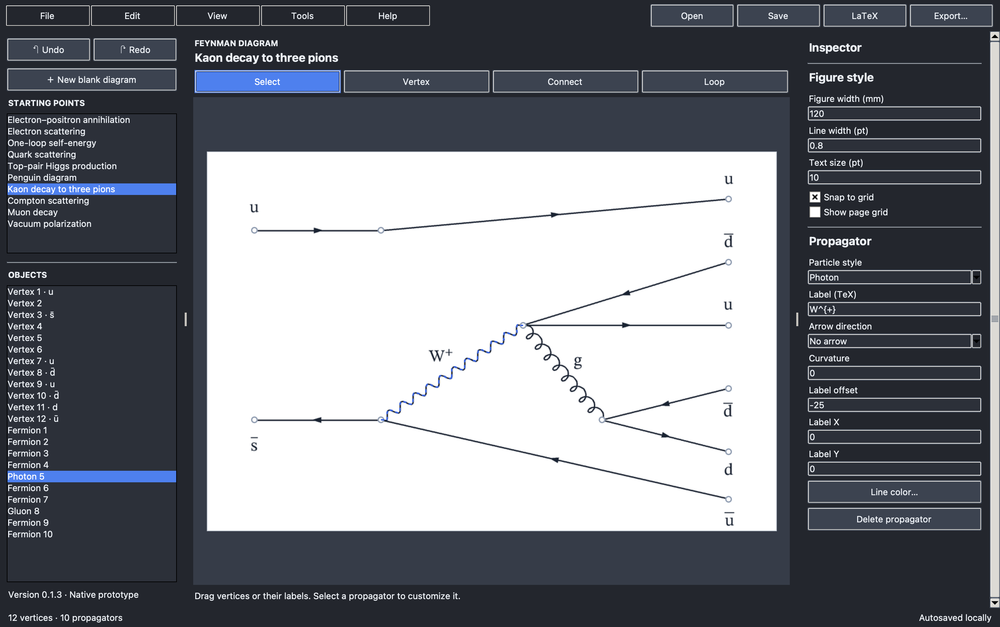

# Feynman Diagram Studio

A lightweight, native desktop editor for drawing publication-ready Feynman diagrams, including LaTeX and SVG/PDF/PNG/JPEG export.



## Features

### General features

- Native GUI for macOS, Windows, and Linux
- Visible File, Edit, View, Tools, and Help menus; automatic system theme with Light and Dark overrides
- Antialiased, high-resolution canvas preview
- 10-, 20-, or 40-unit page grid, vertex snapping, and keyboard nudging
- Undo/redo history and local crash-recovery autosave
- Rename a diagram by double-clicking its title above the canvas or choosing Edit → Rename Diagram
- Editable JSON project files
- Vector SVG/PDF export and PNG/JPEG export at 300, 600, or 1200 ppi
- LaTeX export for TikZ-Feynman, TikZ-FeynHand, feynMP, feynMF, PST-Feyn, and axodraw2

### Feynman diagram features

- Fermion, photon, gluon, scalar, and ghost propagators
- Straight, curved, self-loop, and two-vertex circular paths
- Forward and reverse arrows
- Open, filled, hatched, crosshatched, dotted, and standard interaction vertices
- Edit propagator colors and vertex or propagator labels, with independent label positioning
- Ten starting templates

## Install and run

### Packaged app

Packaged builds include Python and the application dependencies, so no separate runtime is required. When a packaged build is available, download it for your operating system from the project's [GitHub Releases](https://github.com/AlexHeindel/Feynman-Diagram-Studio/releases) page, then follow the matching instructions. If no packaged build is listed yet, use the source installation below.

#### macOS

1. Download and unzip the macOS build for your Mac's processor (`arm64` for Apple silicon or `x64` for Intel).
2. Drag `FeynmanDiagramStudio.app` into `Applications`.
3. Open **FeynmanDiagramStudio** from Applications.

If macOS reports that the app is from an unidentified developer, Control-click the app, choose **Open**, and confirm **Open**. Release builds should be signed and notarized before general distribution.

#### Windows

1. Unzip the Windows download.
2. Move `FeynmanDiagramStudio.exe` to a convenient folder.
3. Double-click `FeynmanDiagramStudio.exe` to run it.

Windows SmartScreen may warn about an unsigned development build. Only choose **More info → Run anyway** when the file came from this repository's official release page.

#### Linux

1. Extract the Linux `.tar.gz` download.
2. Open a terminal in the extracted folder and make the app executable:

   ```bash
   chmod +x FeynmanDiagramStudio
   ```

3. Run it:

   ```bash
   ./FeynmanDiagramStudio
   ```

You can optionally move the executable to a directory on your `PATH`, such as `~/.local/bin`.

### Run from source

Running from source requires Python 3.10 or newer and Tk 8.6+. Clone the repository (or download and extract its source ZIP), then open a terminal in the project folder:

```bash
git clone https://github.com/AlexHeindel/Feynman-Diagram-Studio.git
cd Feynman-Diagram-Studio
```

Continue with the instructions for your operating system.

#### macOS

Apple’s `/usr/bin/python3` is not compatible: it ships old `pip` and obsolete Tk 8.5. Install the current **macOS installer** from [python.org](https://www.python.org/downloads/macos/) first. Then open a new Terminal window and run:

```bash
python3.14 -c 'import sys, tkinter; print(sys.executable, sys.version.split()[0], "Tk", tkinter.TkVersion)'
python3.14 -m venv --clear .venv
source .venv/bin/activate
python -m pip install --upgrade pip setuptools
python -m pip install -e .
python -m feynman_studio
```

The first command should report Python 3.14 and Tk 8.6 or newer. If the installer exposes `python3` rather than `python3.14`, use `python3` in the first two commands.

#### Windows

Install the current 64-bit Python from [python.org](https://www.python.org/downloads/windows/). Leave **Install Tcl/Tk and IDLE** enabled in the installer. In PowerShell, run:

```powershell
py -3 -m venv .venv
.venv\Scripts\Activate.ps1
python -m pip install --upgrade pip setuptools
python -m pip install -e .
python -m feynman_studio
```

If PowerShell blocks the activation script, use Command Prompt instead and activate with `.venv\Scripts\activate.bat`, then run the final three `python` commands above.

#### Linux

On Debian or Ubuntu, install Python, virtual-environment support, and Tk first:

```bash
sudo apt update
sudo apt install python3 python3-venv python3-tk
python3 -m venv .venv
source .venv/bin/activate
python -m pip install --upgrade pip setuptools
python -m pip install -e .
python -m feynman_studio
```

For Fedora, use `sudo dnf install python3 python3-tkinter`; for Arch Linux, use `sudo pacman -S python tk` before creating the virtual environment.

### Run again later

For a packaged app, open the `.app` or `.exe`, or run the Linux executable as described above. For a source installation, return to the repository and reactivate its virtual environment before starting the editor:

```bash
# macOS or Linux
source .venv/bin/activate
python -m feynman_studio
```

```powershell
# Windows PowerShell
.venv\Scripts\Activate.ps1
python -m feynman_studio
```

Pillow handles PNG/JPEG encoding and ReportLab writes vector PDF pages. The editor, SVG renderer, and LaTeX exporters otherwise use the Python standard library.

## Keyboard shortcuts

| Shortcut | Action |
|---|---|
| `V` | Select |
| `A` | Add vertex |
| `C` | Connect vertices |
| `L` | Add loop |
| `Ctrl/Cmd+Z` | Undo |
| `Ctrl/Cmd+Shift+Z` | Redo |
| `Delete` | Delete selection |
| Arrow keys | Nudge selected vertex |
| Shift + arrow keys | Nudge farther (two grid steps while snapping) |

## Build distributable apps

Install build dependencies with `python -m pip install -e '.[dev]'`, then run PyInstaller on the operating system you are packaging for:

```bash
# macOS
python -m PyInstaller --noconfirm --clean --onedir --windowed --name FeynmanDiagramStudio run_feynman_studio.py

# Windows or Linux
python -m PyInstaller --noconfirm --clean --onefile --windowed --name FeynmanDiagramStudio run_feynman_studio.py
```

The GitHub Actions workflow builds and checks Apple silicon macOS, Intel macOS, Windows x64, and Linux x64 packages. Pushing a `v*` tag publishes them to GitHub Releases. These builds are unsigned; macOS Gatekeeper and Windows SmartScreen may show security warnings.

## Tests

```bash
python -m unittest discover -s tests -v
```

The headless test suite covers project compatibility and validation, all propagator geometry, loops, marker and line rendering, SVG safety, and all six LaTeX exporters.

For actual LaTeX rendering checks, install TeX Live with TikZ-Feynman, TikZ-FeynHand, feynMP/feynMF, PST-Feyn, and axodraw2, plus Ghostscript and Poppler's `pdftoppm`. The test runner searches `FDS_TEX_BIN`, the project-local `.texlive/bin/*` directory, and `PATH` for the TeX tools; it also searches `.texlive/ghostscript/bin` for Ghostscript. Run:

```bash
FDS_REQUIRE_LATEX=1 python -m unittest discover -s tests -v
```

This compiles and decodes all ten sample templates and three feature diagrams with every LaTeX format. It checks page bounds and visible output, rendered colors where supported, and the presence and placement of formatted vertex and edge labels against a label-free reference. Without the toolchain, these compilation tests skip unless `FDS_REQUIRE_LATEX=1` is set.

feynMF renders in monochrome. feynMP and feynMF use their libraries' native path layout for curves, which can differ from the editor's sampled curves; the other four LaTeX exporters use sampled paths.

## License

MIT. See [LICENSE](LICENSE).
